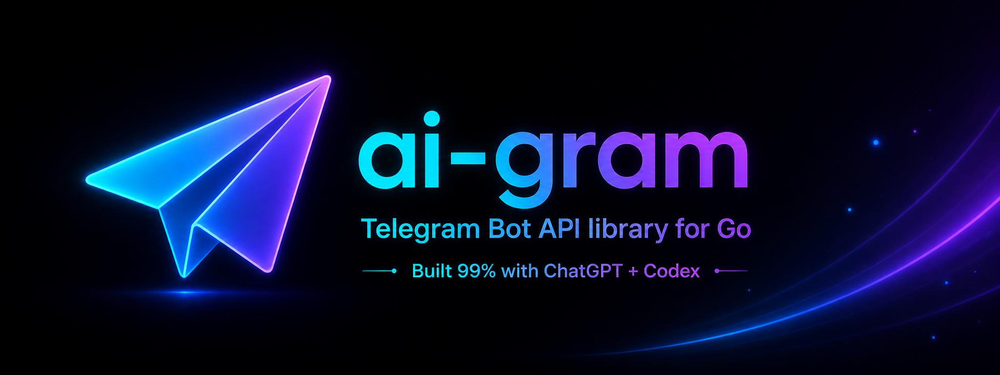

<p align="center">
  
</p>

<h1 align="center">ai-gram</h1>

<p align="center">
  <strong>A production-minded Go Telegram Bot API library built primarily with ChatGPT + Codex under maintainer direction.</strong>
</p>

<p align="center">
  
  
  
  
  
  
  
</p>

<p align="center">
  <a href="#quick-start">Quick start</a> ·
  <a href="docs/API_COVERAGE.md">API coverage</a> ·
  <a href="docs/MANUAL_TESTING.md">Manual testing</a> ·
  <a href="docs/ROADMAP.md">Roadmap</a> ·
  <a href="CHANGELOG.md">Changelog</a>
</p>

`ai-gram` is a typed Go library for building Telegram Bot API clients, update transports, dispatchers, and middleware. It is designed as an AI-native open-source project: the implementation is built almost entirely with ChatGPT and Codex, while architecture, review, scope, and release decisions stay under human maintainer control.

The library focuses on a clear public API, token-safe HTTP behavior, replaceable transports, and testable building blocks instead of framework magic. It is suitable for low-level Bot API calls as well as production bot foundations that need long polling, webhooks, routing, middleware, and typed Telegram data contracts.

## Highlights

- Typed Bot API method parameters, result types, and Telegram update/message contracts.
- JSON and multipart method calls with `FileRef`/`FileUpload` helpers for upload-capable methods.
- Long polling transport, inbound webhook handler, dispatcher/router, predicates, middleware, fallback, and error handling.
- Token-safe configuration with configurable Bot API base URLs for official or local Bot API servers.
- Broad test coverage built around unit tests and `httptest`-friendly client configuration.
- Practical public examples, with advanced maintainer tooling kept separate from the user-facing quick start.

## Quick start

Install the module once the repository or tag you need is available to your Go toolchain:

```bash
go get github.com/xDilettante/ai-gram
```

Create a bot client and call a typed Bot API method:

```go
package main

import (
    "context"
    "fmt"
    "log"
    "os"

    aigram "github.com/xDilettante/ai-gram"
)

func main() {
    token := os.Getenv("AIGRAM_BOT_TOKEN")
    if token == "" {
        log.Fatal("AIGRAM_BOT_TOKEN is required")
    }

    bot, err := aigram.New(aigram.BotConfig{Token: token})
    if err != nil {
        log.Fatal(err)
    }

    me, err := bot.GetMe(context.Background())
    if err != nil {
        log.Fatal(err)
    }

    fmt.Println(me.Username)
}
```

To send messages, use `SendMessage` with typed parameters such as `aigram.SendMessageParams` and `aigram.ChatIDInt` or `aigram.ChatIDString`.

## Why ai-gram

`ai-gram` keeps the library layers separate:

- `telegram` contains Telegram Bot API data contracts.
- `bot` contains the primary Bot API client and typed method parameters.
- `transport/longpoll` provides a managed long polling update source.
- `transport/webhook` provides an inbound webhook HTTP handler.
- `dispatch` routes updates to handlers.
- `middleware` provides reusable dispatcher middleware.
- `errors` exposes typed Telegram API errors.
- The root package `aigram` provides the convenience facade and common re-exports.

The project intentionally keeps AI-assisted development visible without turning it into marketing noise: ChatGPT and Codex produce most of the code and documentation, while the maintainer directs requirements, validates behavior, and decides what is safe to ship.

## Examples

Runnable examples are under [`examples/`](examples/):

- [`examples/echo_longpoll`](examples/echo_longpoll) — basic long polling echo bot.
- [`examples/inline_longpoll`](examples/inline_longpoll) — inline keyboard callbacks and access-control demo.
- [`examples/webhook_server`](examples/webhook_server) — inbound webhook server example.
- [`examples/media_upload`](examples/media_upload) — document upload and file download checks.
- [`examples/local_api_server`](examples/local_api_server) — connectivity check for a local Telegram Bot API server.

Maintainer-only smoke examples are separated under [`examples/maintainer/`](examples/maintainer/) and are not needed for normal library use.

## Documentation

- [`docs/API_COVERAGE.md`](docs/API_COVERAGE.md) — Bot API method/type coverage inventory and architecture notes.
- [`docs/BOT_API_9_6_FINAL_AUDIT.md`](docs/BOT_API_9_6_FINAL_AUDIT.md) — final coverage audit for the local workstream.
- [`docs/BOT_API_9_6_COVERAGE_PLAN.md`](docs/BOT_API_9_6_COVERAGE_PLAN.md) — coverage plan and local-only freeze policy.
- [`docs/MANUAL_TESTING.md`](docs/MANUAL_TESTING.md) — public manual testing guide.
- [`docs/ROADMAP.md`](docs/ROADMAP.md) — stabilization and future work.
- [`CHANGELOG.md`](CHANGELOG.md) — project changelog.
- [`LICENSE`](LICENSE) — MIT license.

Maintainer-only deploy, live-smoke, and release-readiness notes live under [`docs/maintainer/`](docs/maintainer/). They are useful for project maintainers, but intentionally separated from the public quick start.

## Development checks

```bash
gofmt -w .
go test ./...
go vet ./...
git diff --check
```

For script syntax checks:

```bash
bash -n scripts/*.sh
```

## Safety notes

- Never commit real bot tokens, webhook secrets, private chat IDs, payment payloads, passport data, managed bot tokens, or token-bearing URLs.
- `SetWebhook` supports the official upload-only certificate path via `FileUpload`; certificate live checks should use disposable test certificates only.
- `GetChat` remains a backward-compatible minimal chat decode. Use `GetChatFullInfo` for the full `getChat` result shape.
- `ChatMember` keeps a flat compatibility shape while decoding current official fields.
- `CallbackQuery.Message` remains available for accessible messages; maybe-inaccessible callback message data is represented separately for compatibility.
