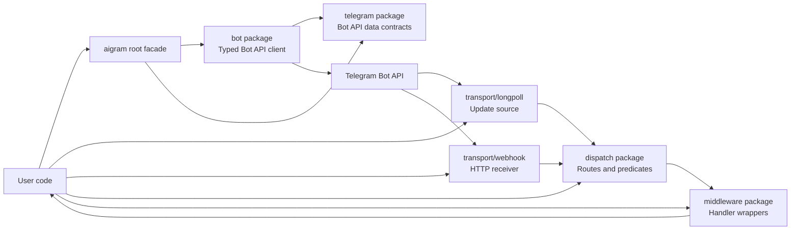

# Architecture

`ai-gram` is organized as a library of small layers. Applications can use the low-level Bot API client directly, wire update transports into their own runtime, or add the dispatcher and middleware packages when they want routing.

## Outgoing requests

The `bot` package owns outgoing Telegram Bot API calls. It accepts typed parameter structs, validates required fields, encodes JSON or multipart requests, decodes typed results, and returns typed Telegram API errors where possible. A configurable HTTP client and base URL make the layer testable with `httptest` and usable with the official or local Telegram Bot API server.

## Incoming updates

`transport/longpoll` fetches updates through `getUpdates`. `transport/webhook` validates inbound webhook HTTP requests and decodes update JSON. Both transports can feed any handler implementing the small update handler interface, including the `dispatch.Dispatcher`.

`dispatch` routes already received `telegram.Update` values. It does not own the Bot API client, so application code can decide whether handlers call Telegram, enqueue work, or only observe updates. `middleware` wraps handlers for reusable concerns such as access control.

## File uploads

Telegram's official `InputFile` concept is represented by `FileRef` and `FileUpload` in the client layer. Existing file IDs and URLs stay in JSON requests when the method allows them. New uploads use multipart requests and deterministic `attach://` references for media, thumbnails, covers, webhook certificates, and other upload-capable fields.

## Compatibility choices

- `GetChat` remains a backward-compatible minimal chat decode.
- `GetChatFullInfo` exposes the full current `getChat` result shape.
- `ChatMember` keeps a flat compatibility shape while decoding current official fields.
- `CallbackQuery.Message` remains available for accessible messages; maybe-inaccessible callback message data is represented separately for compatibility.
